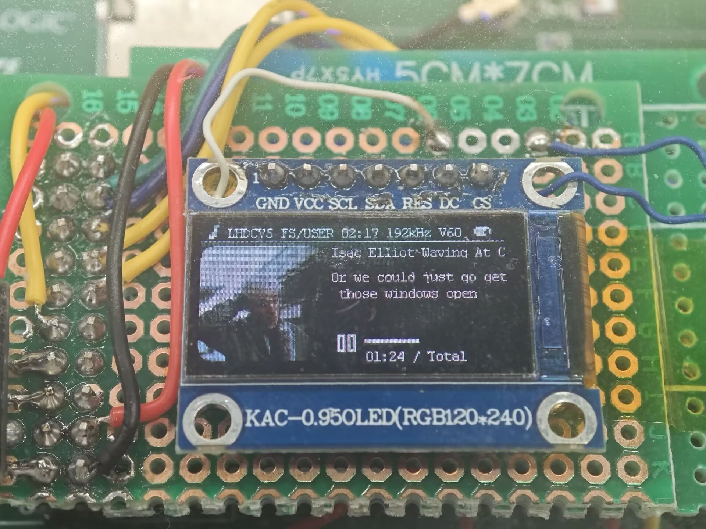
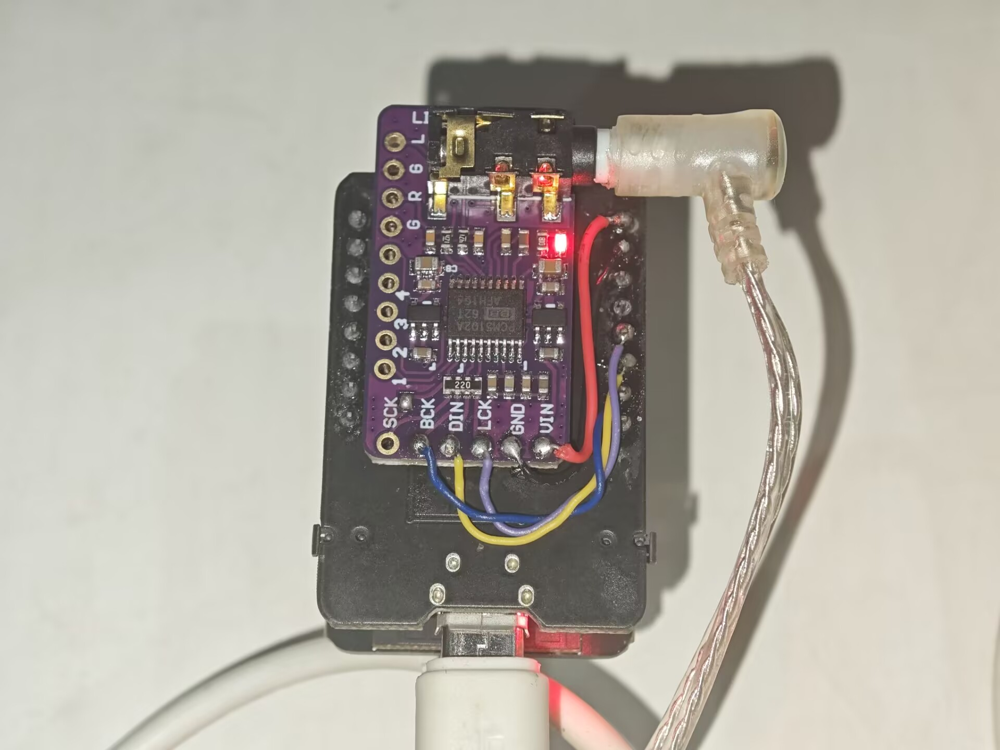

# Espressif IoT Development Framework

* [中文版](./README_CN.md)

ESP-IDF is the development framework for Espressif SoCs supported on Windows, Linux and macOS.

# Supported Codecs

| Codec | Rates / depth | Notes |
|-------|---------------|-------|
| **[LDAC](https://github.com/cfint/libldac-dec/tree/esp32)** | up to 96 kHz / 32-bit | 660 / 909 / 990 kbps |
| **[LHDC V5](https://github.com/sprlightning/LHDC-V5-Decoder/tree/esp32-d0wd)** | up to 192 kHz / 24-bit | 400–1000 kbps |
| **[aptX / aptX-HD / aptX-LL](https://github.com/cfint/libfreeaptx-esp/tree/master)** | up to 48 kHz / 24-bit | |
| **[Opus](https://github.com/xiph/opus/tree/main)** | 48 kHz | |
| **[LC3plus](https://github.com/cfint/liblc3/tree/esp32)** | up to 96 kHz | |
| **[AAC](https://github.com/cfint/arduino-fdk-aac/tree/idf_component)** | up to 48 kHz | Helix decoder |
| **[SBC](components/bt/host/bluedroid/external/sbc)** | 44.1 / 48 kHz | stock baseline |

# New Functions

| Function | Notes |
|----------|-------|
| AVRCP Absolute Volume Control | Bidirectional Absolute Volume Control, ported from ESP-IDF V5.1.6 |
| AVRCP Coverart Display | Receive and display album coverart images sent by A2DP Source devices such as mobile phones, ported from ESP-IDF V6.1.0 & V5.5.2 |

> WARNING: This branch needs PSRAM. If you are find a internal way, you can use the branch [a2dp-codecs/v6.1.0](https://github.com/sprlightning/esp-idf-bt-multiple-codecs/tree/a2dp-codecs/v6.1.0) .

# Contributions

| User | Contributions |
|------|---------------|
| **[cfint](https://github.com/cfint)** | First port multiple decoders from AOSP to ESP‑IDF |
| **[O2C14](https://github.com/O2C14)** | Independently implemented and open‑sourced the source code of the LDAC decoder |
| **[WillyBilly06](https://github.com/WillyBilly06)** | Independently implemented and open‑sourced the source code of the LHDC V5 decoder |
| **[sprlightning](https://github.com/sprlightning)** | Implemented the LHDC V5 decoder with Split Workspace support, continued maintaining cfint's ESP‑IDF V5.1.4, added LHDC V5 support, added AVRCP Absolute Volume Control, and added AVRCP Coverart Display |

# How to USE

First clone this repository, and then run `git submodule update --init --recursive`.

## Example Demo

The example demo is [MLX_Player_ClassicBT/tree/dev/v5.1.4](https://github.com/sprlightning/MLX_Player_ClassicBT/tree/dev/v5.1.4) , it proves **esp32-d0wd can decode LHDC V5 at 192kHz/24bit with 0 stuck and 0 pop**. More details please visit the [disscussion](https://github.com/sprlightning/esp-idf-bt-multiple-codecs/discussions) .

> Example demo use the ESP32-CAM module (also called ESP-32S, chip is esp32-d0wd, 4MB Flash, 8MB PSRAM) with PCM5102A DAC module.

# How to Switch Codecs

Use [Bluetooth Codec Changer](https://play.google.com/store/apps/details?id=com.amrg.bluetooth_codec_converter).

# ESP-IDF Release Support Schedule

- Please read [the support policy](SUPPORT_POLICY.md) and [the documentation](https://docs.espressif.com/projects/esp-idf/en/latest/esp32/versions.html) for more information about ESP-IDF versions.
- Please see the [End-of-Life Advisories](https://www.espressif.com/en/support/documents/advisories?keys=&field_type_of_advisory_tid%5B%5D=817) for information about ESP-IDF releases with discontinued support.

# ESP-IDF Release and SoC Compatibility

The following table shows ESP-IDF support of Espressif SoCs where ![alt text][preview] and ![alt text][supported] denote preview status and support, respectively. The preview support is usually limited in time and intended for beta versions of chips. Please use an ESP-IDF release where the desired SoC is already supported.

|Chip         |          v4.2          |         v4.3           |          v4.4          |          v5.0          |         v5.1           |                                                            |
|:----------- | :---------------------:| :---------------------:| :---------------------:| :---------------------:| :--------------------: | :----------------------------------------------------------|
|ESP32        | ![alt text][supported] | ![alt text][supported] | ![alt text][supported] | ![alt text][supported] | ![alt text][supported] |                                                            |
|ESP32-S2     | ![alt text][supported] | ![alt text][supported] | ![alt text][supported] | ![alt text][supported] | ![alt text][supported] |                                                            |
|ESP32-C3     |                        | ![alt text][supported] | ![alt text][supported] | ![alt text][supported] | ![alt text][supported] |                                                            |
|ESP32-S3     |                        |                        | ![alt text][supported] | ![alt text][supported] | ![alt text][supported] | [Announcement](https://www.espressif.com/en/news/ESP32_S3) |
|ESP32-C2     |                        |                        |                        | ![alt text][supported] | ![alt text][supported] | [Announcement](https://www.espressif.com/en/news/ESP32-C2) |
|ESP32-C6     |                        |                        |                        |                        | ![alt text][supported] | [Announcement](https://www.espressif.com/en/news/ESP32_C6) |
|ESP32-H2     |                        |                        |                        |                        | ![alt text][supported] | [Announcement](https://www.espressif.com/en/news/ESP32_H2) |

[supported]: https://img.shields.io/badge/-supported-green "supported"
[preview]: https://img.shields.io/badge/-preview-orange "preview"

Espressif SoCs released before 2016 (ESP8266 and ESP8285) are supported by [RTOS SDK](https://github.com/espressif/ESP8266_RTOS_SDK) instead.

# Developing With ESP-IDF

## Setting Up ESP-IDF

See https://idf.espressif.com/ for links to detailed instructions on how to set up the ESP-IDF depending on chip you use.

**Note:** Each SoC series and each ESP-IDF release has its own documentation. Please see Section [Versions](https://docs.espressif.com/projects/esp-idf/en/latest/esp32/versions.html) on how to find documentation and how to checkout specific release of ESP-IDF.

### Non-GitHub forks

ESP-IDF uses relative locations as its submodules URLs ([.gitmodules](.gitmodules)). So they link to GitHub. If ESP-IDF is forked to a Git repository which is not on GitHub, you will need to run the script [tools/set-submodules-to-github.sh](tools/set-submodules-to-github.sh) after git clone.

The script sets absolute URLs for all submodules, allowing `git submodule update --init --recursive` to complete. If cloning ESP-IDF from GitHub, this step is not needed.

## Finding a Project

As well as the [esp-idf-template](https://github.com/espressif/esp-idf-template) project mentioned in Getting Started, ESP-IDF comes with some example projects in the [examples](examples) directory.

Once you've found the project you want to work with, change to its directory and you can configure and build it.

To start your own project based on an example, copy the example project directory outside of the ESP-IDF directory.

# Quick Reference

See the Getting Started guide links above for a detailed setup guide. This is a quick reference for common commands when working with ESP-IDF projects:

## Setup Build Environment

(See the Getting Started guide listed above for a full list of required steps with more details.)

* Install host build dependencies mentioned in the Getting Started guide.
* Run the install script to set up the build environment. The options include `install.bat` or `install.ps1` for Windows, and `install.sh` or `install.fish` for Unix shells.
* Run the export script on Windows (`export.bat`) or source it on Unix (`source export.sh`) in every shell environment before using ESP-IDF.

## Configuring the Project

* `idf.py set-target <chip_name>` sets the target of the project to `<chip_name>`. Run `idf.py set-target` without any arguments to see a list of supported targets.
* `idf.py menuconfig` opens a text-based configuration menu where you can configure the project.

## Compiling the Project

`idf.py build`

... will compile app, bootloader and generate a partition table based on the config.

## Flashing the Project

When the build finishes, it will print a command line to use esptool.py to flash the chip. However you can also do this automatically by running:

`idf.py -p PORT flash`

Replace PORT with the name of your serial port (like `COM3` on Windows, `/dev/ttyUSB0` on Linux, or `/dev/cu.usbserial-X` on MacOS. If the `-p` option is left out, `idf.py flash` will try to flash the first available serial port.

This will flash the entire project (app, bootloader and partition table) to a new chip. The settings for serial port flashing can be configured with `idf.py menuconfig`.

You don't need to run `idf.py build` before running `idf.py flash`, `idf.py flash` will automatically rebuild anything which needs it.

## Viewing Serial Output

The `idf.py monitor` target uses the [esp-idf-monitor tool](https://github.com/espressif/esp-idf-monitor) to display serial output from Espressif SoCs. esp-idf-monitor also has a range of features to decode crash output and interact with the device. [Check the documentation page for details](https://docs.espressif.com/projects/esp-idf/en/latest/get-started/idf-monitor.html).

Exit the monitor by typing Ctrl-].

To build, flash and monitor output in one pass, you can run:

`idf.py flash monitor`

## Compiling & Flashing Only the App

After the initial flash, you may just want to build and flash just your app, not the bootloader and partition table:

* `idf.py app` - build just the app.
* `idf.py app-flash` - flash just the app.

`idf.py app-flash` will automatically rebuild the app if any source files have changed.

(In normal development there's no downside to reflashing the bootloader and partition table each time, if they haven't changed.)

## Erasing Flash

The `idf.py flash` target does not erase the entire flash contents. However it is sometimes useful to set the device back to a totally erased state, particularly when making partition table changes or OTA app updates. To erase the entire flash, run `idf.py erase-flash`.

This can be combined with other targets, ie `idf.py -p PORT erase-flash flash` will erase everything and then re-flash the new app, bootloader and partition table.

# Resources

* Documentation for the latest version: https://docs.espressif.com/projects/esp-idf/. This documentation is built from the [docs directory](docs) of this repository.

* The [esp32.com forum](https://esp32.com/) is a place to ask questions and find community resources.

* [Check the Issues section on github](https://github.com/espressif/esp-idf/issues) if you find a bug or have a feature request. Please check existing Issues before opening a new one.

* If you're interested in contributing to ESP-IDF, please check the [Contributions Guide](https://docs.espressif.com/projects/esp-idf/en/latest/contribute/index.html).
